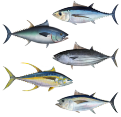

PolyTuna
-----

    This is a work in progress
    
A DIY polyphonic guitar tuner pedal. With it you can check the tuning of all the strings with a single strum, saving you time when you need it most. Very useful for playing live!

This work has been developed by [Sergio Sánchez](https://github.com/SerjSanchez) as his Bachelor's Thesis, with [David Estevez](https://github.com/David-Estevez) as his advisor. The Thesis itself can be downloaded [here](https://github.com/UC3Music/PolyTuna/raw/master/Memoria.pdf) (in Spanish).

The work has three main parts:

* A preeliminary study of the guitar signal to decide the best analysis technique for the pedal. This study was made in Matlab and the sources for the study can be found in the `MATLAB Analysis` folder.
* A software implementation of the polyphonic tuner to validate the algorithms prior to the hardware implementation. This code is written in Python and contained in the `Software tuner` folder.
* A hardware implementation (i.e. the pedal itself). The firmware for the device is stored in the `Polytuna Teensy Edition` folder. The schematics can be found in the [Thesis document](https://github.com/UC3Music/PolyTuna/raw/master/Memoria.pdf). The full circuit and the PCB KiCad project can be found at [`Polytuna KiCad`](https://github.com/UC3Music/PolyTuna/tree/master/Polytuna%20KiCad) folder.

Some pictures of the prototype:

#### Author
	
* Sergio Sánchez 

#### Advisor
    
*  [David Estévez Fernández](https://github.com/David-Estevez)
